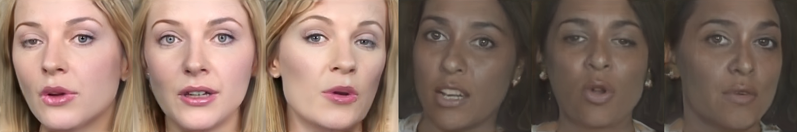

# 3D-Aware Video Generation</sub>



**3D-Aware Video Generation**<br>
[Sherwin Bahmani](https://sherwinbahmani.github.io), [Jeong Joon Park](https://jjparkcv.github.io), [Despoina Paschalidou](https://paschalidoud.github.io), [Hao Tang](https://scholar.google.com/citations?user=9zJkeEMAAAAJ&hl=en), [Gordon Wetzstein](https://stanford.edu/~gordonwz), [Leonidas Guibas](https://geometry.stanford.edu/member/guibas), [Luc Van Gool](https://ee.ethz.ch/the-department/faculty/professors/person-detail.OTAyMzM=.TGlzdC80MTEsMTA1ODA0MjU5.html), [Radu Timofte](http://people.ee.ethz.ch/~timofter)<br>
### [Project Page](https://sherwinbahmani.github.io/3dvidgen) | [Paper](https://arxiv.org/abs/2206.14797)<br>

Abstract: *Generative models have emerged as an essential building block for many image synthesis and editing tasks. Recent advances in this field have also enabled high-quality 3D or video content to be generated that exhibits either multi-view or temporal consistency. With our work, we explore 4D generative adversarial networks (GANs) that learn unconditional generation of 3D-aware videos. By combining neural implicit representations with time-aware discriminator, we develop a GAN framework that synthesizes 3D video supervised only with monocular videos. We show that our method learns a rich embedding of decomposable 3D structures and motions that enables new visual effects of spatio-temporal renderings while producing imagery with quality comparable to that of existing 3D or video GANs.*

## Requirements
The codebase is tested on 
* Python 3.7
* PyTorch 1.7.1
* 4 NVIDIA GPUs (Tesla V100 32GB) with CUDA version 11.0

For additional python libraries, please install by:

```
pip install -r requirements.txt
```

Please refer to https://github.com/NVlabs/stylegan2-ada-pytorch for additional software/hardware requirements.

## Dataset
Datasets have to be in a subdirectory, as the dataset class is setup for different splits / classes, e.g., position the videos as /path/to/dataset/subdirectory/{video_0...video_x}/{img_0...img_y}.png. Then specify /path/to/dataset as the dataset path
Datasets can be downloaded here:
- FaceForensics: https://github.com/ondyari/FaceForensics
- TaiChi: https://github.com/AliaksandrSiarohin/first-order-model
- MEAD: https://wywu.github.io/projects/MEAD/MEAD.html

We resize FaceForensics and MEAD to the 256x256 resolution and TaiChi to the 128x128 resolution.

## Pre-trained Checkpoints
You can download the pre-trained checkpoints used in our paper:
| Dataset   | Resolution |                           Download                           |
| :-------- | :--------: | :----------------------------------------------------------: |
| FaceForensics      |    256     |  [Google Drive](https://drive.google.com/file/d/1JlYxZH5UPFov9-bLv7cqXn-3_EqWGQgJ) |
| FaceForensics (pre-trained on FFHQ)      |    256     |  [Google Drive](https://drive.google.com/file/d/1hveQwdPpXtYHawcXFKQZ1NDxSKlHesgz) |
| MEAD      |    256     |  [Google Drive](https://drive.google.com/file/d/17Uhx2hxgR4-M4lee5uvvv4Ok1AuiE5mJ) |
| TaiChi      |    128     |  [Google Drive](https://drive.google.com/file/d/1O0YkKBsu3D-t-YiVhnq01JBQ6ZbsnazM) |

## Train a new model
```bash
python run_train.py outdir=/path/to/experiment_output data=/path/to/dataset cache_metrics_dir=/path/to/experiment_output/metrics_cache spec=paper model=stylenerf_faceforensics resolution=256
```

- Specify ```cache_metrics_dir``` in a cache directory, where the FVD calculations will be done
- Change ```resolution``` to e.g. 128 for our TaiChi experiment
- Set ```model=stylenerf_faceforensics``` to one out of {stylenerf_faceforensics,stylenerf_taichi,stylenerf_mead,stylenerf_sky} depending on the dataset
- Add ```resume=/path/to/pkl``` to resume from a checkpoint
- Add ```spec.ref_gpus=4 spec.mb=32 spec.mbstd=8``` to change number of GPUs, total batch size, and batch size per GPU

Please check configuration files at ```conf/model``` and ```conf/spec```. You can always add your own model config. More details on how to use hydra configuration please follow https://hydra.cc/docs/intro/.

## Render videos with a pre-trained model
```bash
python generate.py --outdir /path/to/output --truncation_psi 1.0 --seeds 0 --network_pkl /path/to/network.pkl --render_program rotation_camera_yaw --time_steps 16 --n_steps 16
```

- Change ```--render_program rotation_camera_yaw``` to any of the other rendering programs {rotation_camera_yaw,rotation_camera_yaw_pitch,front,front_zoom}
- Change ```--seeds 0``` to any other integer to render a content code with a different seed
- Add ```--motion_seeds 0``` or any other integer to render a content code with different motion codes

Or use ```visualize.sh``` to generate videos from 10 (or more) different seeds for all rendering programs directly.

## Evaluate model

Use ```evaluate.sh``` to evaluate a trained model for the FVD metric.

## License

Our main code is based on the [StyleNeRF](https://github.com/facebookresearch/StyleNeRF) and [DIGAN](https://github.com/sihyun-yu/digan) repositories, while our evaluation code follows the [StyleGAN-V](https://github.com/universome/stylegan-v) implementation. Hence, the majority of our code is licensed under [CC-BY-NC](https://creativecommons.org/licenses/by-nc/4.0/), however, portions of this project are available under a separate license terms: all codes used or modified from [stylegan2-ada-pytorch](https://github.com/NVlabs/stylegan2-ada-pytorch) are under the [Nvidia Source Code License](https://nvlabs.github.io/stylegan2-ada-pytorch/license.html).
